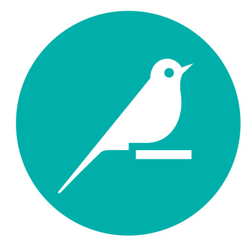

<h1 align="center">Hi 👋, I'm Loïc</h1>
<h3 align="center">MSc student with a passion in AI/ML and Data Science.   Passionate developer and technology enthusiast dedicated to crafting clean, efficient code and building innovative solutions.</h3>

 

- 📫 How to reach me: **loic.richonnier@eurecom.fr**

<h3 align="left">Connect with me:</h3>

<h3 align="left">Languages and Tools:</h3>

 
   
   
   
   
   
   
  
   
   
  
  

  
   
   
    

<h3 align="left">Cloud Plateform:</h3>
  

  
  
  
  

